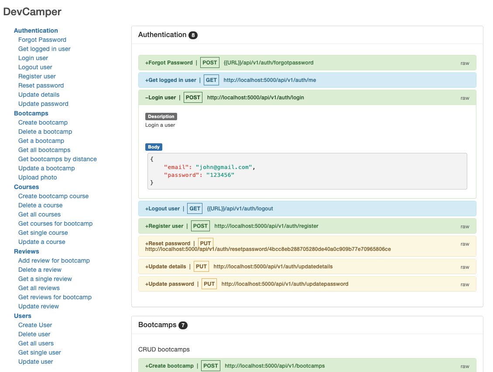

# Dev-Bootcamp-Tracker API

> Backend API for DevCamper application,
> which is a bootcamp directory website

## About

A backend restful api developed to allow users to CRUD bootcamps. Users have assigned roles and permission and can CRUD bootcamps. Authentication is implemented with JWTs. Provides email reset functionality. Advance Query relationships are used with mongoose. Docgen and postmant is used to create index.html documentation.

## Technologies

RESTFUL API / Express / Node / MongoDB / Mongoose / JWT / DigitalOcean / Nodemailer / Multer

## Usage

Rename "config/config.env.env" to "config/config.env" and update the values/settings to your own

##

## Install Dependencies

```
npm install
```

## Run App

```
# Run in dev mode
npm run dev

# Run in production mode
npm start
```

\*\* Check out the live app on[DigitalOcean](https://dev-bootcamp-tracker.online/)



- Version: 1.0.0

- License: MIT
